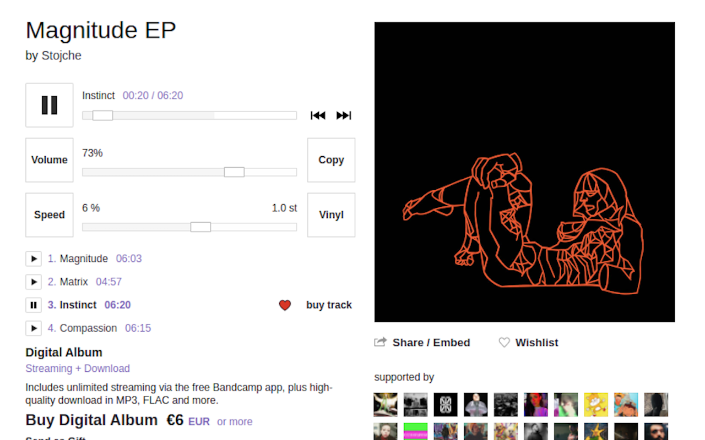

Add multiple features to <a href="https://www.bandcamp.com/">bandcamp.com</a>

## 🚀 Download

** [Chrome](https://chrome.google.com/webstore/detail/bandcamp%2B/hggjmjobahhmbmnfndhdgidchhhhjkad)**

** [Firefox](https://addons.mozilla.org/firefox/addon/bandcamp)**

## 📖 Features

- Arrange Bandcamp layout
- Wishlist single tracks from release page
- Add volume control
- Add speed control with vinyl and stretched modes
- Copy track info to clipboard

### ⌨️ Keyboard Shortcuts

`Space` play/pause

`C` copy track info

`W` wishlist current track

`Shift + W` wishlist release

`N` next track

`P` previous track

`Shift + P` play first track

`→` seek 10 sec forward

`←` seek 10 sec backward

`Shift + ←` seek start

`↑` increase volume

`↓` decrease volume

`R` reset volume

`Shift + ↑` increase speed

`Shift + ↓` decrease speed

`Shift + R` reset speed
